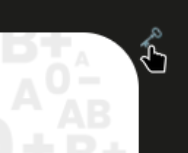

# AFDS 24 Ore countdown webapp

Released under [BSD 3-Clause License](LICENSE.md)

This is a countdown plus donations counter for the [AFDS 24 ore initiative](https://www.portaledeldono.it/news/news/presentazione-24-ore-del-dono/).
The application is reachable there: https://afds-24ore-countdown-frontend.onrender.com/

The size of the panel may change depending on your device, however the format of the banner will keep its proportions.

## Authentication and totem usage

For the totem usage, and also for the admin options it is possible to do a login by clicking or tapping in the top right corner:

when done, it is possible to logout with an action in the same location:

after login, the app will switch to the totem mode, providing also the registration buttons:

The donation registration actions will be disabled for a moment after each click to prevent multiple registrations at once.

## Admin actions

If the credentials used are privileged, a privileged actions section will be shown at the bottom left part of the page:

by clicking on that crown, the section will expand and the privileged options will be made available:

In there it is possible to reduce the number of the donations for each type and act on the countdown timer, specifically:\
* resume: this will reset the timer as per default configured start and end dates.
* stop: this will make the timer reset and though it will behave like it was never started
* restart: this will start immediately (in 15 seconds) the timer
* end: this will make the timer fast foward to the end of the countdown.

The red background will show the countdown mode, the default one is the automatic mode and though the "resume" option is highlighted.
When moving to the manual mode (with any other countdown action) the other actions will be highlighted:

Using the countdown actions, the timer will be syncronized in all the clients in ~ 5 seconds, wich is the polling time of the clients

## Countdown behaviour

When the countdown still have to start, the stand-by text will blink:

Right before the start, exactly 10 seconds before, a pre-countdown will start counting down from 10 with a dedicated animation.\
When the countdown will be completed, the timer will stop at 00:00:00 and will start blinking.

All these behaviours can be triggered by using the admin actions.